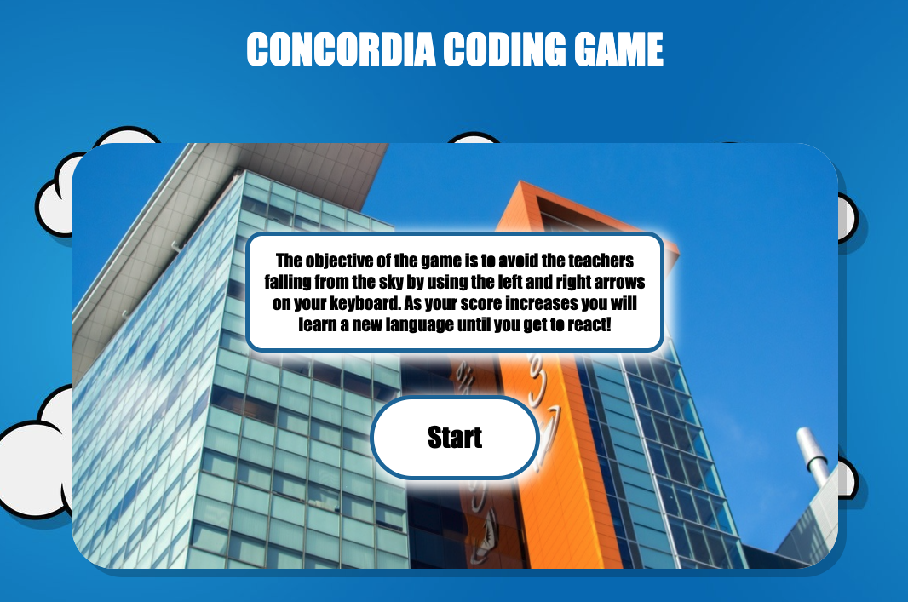

# Object Oriented Programming Game Project

## The game

This game is called the **Concordia Coding Game**. Essentially, you need to avoid: Diana, Richard, and Tiffany from falling on top of you with a whole bunch of hard new knowledge. The longer you can avoid them by using the left and right arrow keys, the higher your time score in the right corner gets. With the time increasing this allows all the new knowledge to sink in and your character will evolve. From a little html5 all the way into a react frontend master!

## Gameplay

### Things I changed

I changed multiple things in this game:

- I made the game screen bigger, centered it, and added a cool background
- I added a start button, and a quick description of the game at the start that leaves after clicked
- I changed the enemies, added 3 of them, and increase the enemy slots + enemy amount
- I added a timer at the top right corner
- I allow the main character to change as the time score increases
- I added a clear button when your character runs into an enemy and the game ends

## Game Link

- https://goofy-heisenberg-930615.netlify.app/